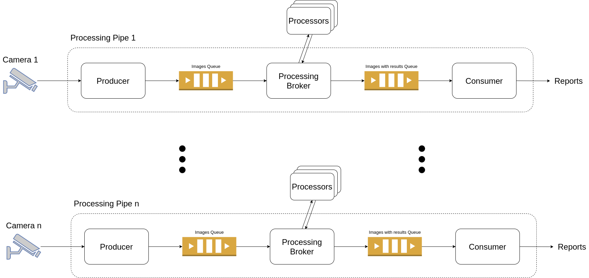
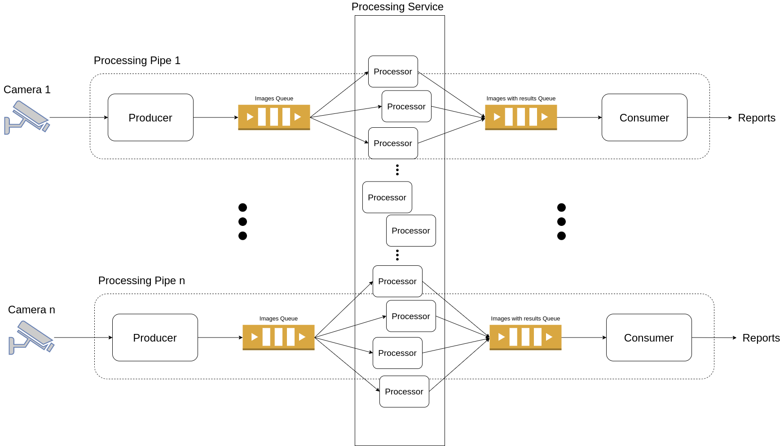

# video-stream-processing

a straightforward and real-time video processing framework for computer vision tasks in production.
The framework components are written in python and using Apache Kafka in between to ensure fault tolerance.
This version guarantee images order which required in some application like object tracking



the framework consists of three main components that can be easily modified to fit your requirements.
- **Producer** produces video feed into the framework. The Producer read images from a remote camera (tested with a local camera attached with Raspberry-pi) to a Kafka topic. These images have to be cast to Protobuff object in bytes form.
- **Processing Broker** routes images produced by the Producer from a Kafka topic to a plug and play processing GRPC server. The broker makes async calls to the external processor service, to prevent the external processor processing time to affect the framework throughput The processor can be any image processing algorithm that inputs an image and returns a result for that image. Then the broker puts an image with the result to another Kafka topic.
- **Consumer** consumes images with results produced by the Processing Broker from a Kafka topic and show on the screen. This can be modified to generate reports or notify users or do some more light processing using the results from the processor, depending on your requirements.

### How to get it running (docker and docker-compose Kafka-docker required)
Get your remote camera running and put the URL to producer/docker-compose.yaml in CAMERA_ID. Run Kafka single zookeeper and single broker from [this repo](https://github.com/wurstmeister/kafka-docker). They have to be run in order, starting from right to left.
#### Consumer
```shell
cd consumer/ && docker-compose up
```
start a new terminal
#### Simulate a YOLO v5 as an external processor
```shell
cd processor/ && docker-compose up
```
start a new terminal
#### Processing Broker
```shell
cd processing_broker/ && docker-compose up
```
start a new terminal
#### Producer
```shell
cd producer/ && docker-compose up
```

### Benefits of using Apache Kafka
The Kafka queues are not required in the framework but they provide maintainability and fault tolerance to the system.
We can surely trust that all images read from the consumer will be processed. If something went wrong along the pipe the information to start over will still be in the Kafka queues.



### If images order is not required
The Processing Broker in this version is multi-threaded which is unscalable to some extent. if your system does care about ordering of the images we can modify the Processing Broker to be single-threaded and create multiple partitions in Kafka topic instead. Then spawn multiple Processing Broker equal to the number of partitions. This way your application can be infinitely scaled :D